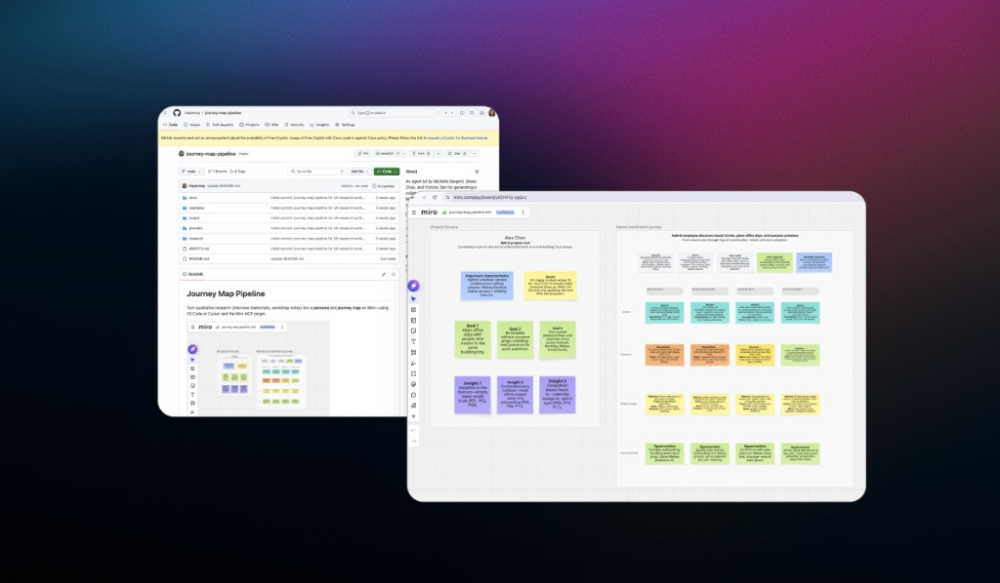

# From Transcripts to Miro: A Human-in-the-Loop AI Journey Map Pipeline

Every UX researcher in the room had done the same painful work: copy interview quotes into journey map templates, row by row, swim lane by swim lane, until the board looked polished enough to share. When Victoria Tam walked our team through the old workflow, the room nodded. We had all lived it.

That was the opening for a workshop I co-facilitated with Victoria and Qiwen Zhao, not to replace researchers, but to give them a repeatable pipeline that handles the tedious synthesis and leaves the judgment where it belongs: with humans.

## The problem

Qualitative research produces rich data. Journey maps produce alignment. The gap between them is hours of manual transcription, copying actions, tools, pain points, and opportunities into structured templates. Teams wanted to use AI to speed this up, but early experiments raised familiar fears: stereotyped personas, hallucinated pain points, outputs that looked polished but weren't grounded in what participants actually said.

We needed a workflow that was fast *and* trustworthy. Speed without grounding is just automation of bad research.

## How we designed the workshop

We built the session for researchers who may never have opened a code editor. That meant three deliberate choices:

1. **Show the before state first.** Victoria walked through the traditional copy-paste workflow so everyone felt the pain we were solving.
2. **Prerequisites as Session Zero.** GitHub Copilot, VS Code, and enterprise GitHub access aren't trivial in a corporate environment. We treat setup as its own onboarding deck: [Session Zero](../session-zero-ai-development-foundation/), with no skipped steps and lots of visuals.
3. **Hands-on with real data.** Participants cloned a pipeline repo, installed the Miro MCP server, and ran synthesis on actual interview transcripts from a research study, not a toy example.

Caitlin Boyd piloted the workshop beforehand and gave us critical feedback from a newcomer's perspective. That dry run changed pacing, troubleshooting guidance, and how we framed the human review step.

## The methodology: a linear pipeline with a human gate

The core artifact is a reusable **AI Journey Map Pipeline**: a structured repository that takes qualitative inputs and produces collaborative Miro stickies, not a finished deliverable.

### Folder architecture

The repo is designed so humans and agents each know their lane:

- **`research/`**: Humans add transcripts (.vtt files), markdown notes, any qualitative input
- **`examples/`**: Read-only reference templates (persona content, journey content, layout, emotional scale). The agent reads these; it does not edit them
- **`prompts/`**: Operational runbook: step-by-step instructions for the agent to execute repeatable Miro operations
- **`docs/`**: "What done looks like" for humans. Board anatomy, layout expectations
- **`output/`**: Generated artifacts: persona content, journey content, layout JSON. The human reviews here before anything syncs to Miro

Two root files anchor the system:

- **`README.md`**: For humans: prerequisites, troubleshooting, how to run the workflow
- **`AGENTS.md`**: For AI agents: rules, constraints, and context loaded on every interaction. Markdown is intentional: lightweight, token-efficient, and the format agents read best

### Human-in-the-loop by design

The pipeline instructs the agent to **pause and ask for human approval** before pushing to Miro. The output is deliberately *not* a polished journey map. It's a collaborative board with stickies, designed to invite iteration, debate, and researcher expertise.

Research is conducted by humans interviewing humans. Synthesis is assisted by AI. Interpretation and refinement stay human.

### Miro MCP integration

We use the official Miro MCP server to bridge the IDE and the board. Key tools in the pipeline:

- **context_explore**: Check whether the board is empty or already has content
- **layout_get_dsl**: Read existing board items as structured text (domain-specific language)
- **layout_create**: Build persona and journey frames with stickies after human approval
- **layout_read / layout_update**: Read and adjust existing frames

Participants install the MCP server in their IDE, paste a starter prompt from the README (with their own Miro board URL), and let the agent synthesize. The agent produces output files; the human reviews; only then does the board update.

### What participants walk away with

Running the pipeline once produces four things:

1. A **grounded persona** in Miro, name, role, quote, goals, insights
2. A **journey map** with phase columns and populated swim lanes
3. **Synthesized markdown artifacts** in the output folder (useful even if you skip Miro)
4. The **pipeline itself**: rerun with new transcripts anytime

## Outcomes

The workshop landed with a team that had been asking for exactly this: a way to use GitHub Copilot for journey map artifacts without sacrificing research integrity. Leadership framed it as the kind of exploration the team should be leading, automating what can be automated while keeping human expertise in the loop.

Matt Starr, our design director, put it directly: *"Greg really wants to use our team as a leader in the UX AI-native space. These are the kind of things that will get us there."*

Qiwen Zhao, who co-facilitated the earlier Copilot workshop that led to this session, noted the demand: researchers across teams wanted to learn artifact generation: personas, journey maps, not just basic Copilot features.

## What you can take away

If you're building AI workflows for research teams, three principles held up in practice:

1. **Structure before prompts.** A folder architecture and `AGENTS.md` give the AI boundaries. Unstructured "just ask Copilot" sessions produce inconsistent, ungrounded output.
2. **Human gates are features, not friction.** Pausing before Miro sync builds trust. Researchers need to see and edit synthesis before it becomes a deliverable.
3. **Outputs should invite collaboration.** Stickies, not polished maps. The goal is a starting point that saves hours of copy-paste, not a finished artifact that skips team review.

The pipeline is designed to be forked and adapted. During the workshop I demonstrated changing emotional-scale sticky colors by editing the pipeline in plan mode, a small customization that propagates across every future run. That's the point: teach the system, then let teams make it theirs.

Research stays human. Synthesis gets faster. The board stays collaborative.
