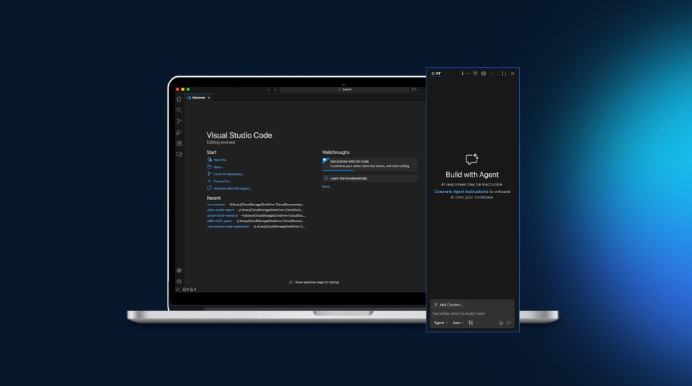

# Session Zero: AI Development Foundations for First-Time IDE Users

The workshop was supposed to start in an hour. Half the room still couldn't sign into GitHub. Someone had Copilot approval but the wrong account format. Another person installed VS Code from the public web instead of the enterprise app store. A researcher asked, quietly, *"What is an IDE?"*

That was the moment Caroline Miller and I knew we needed a separate session: not a five-minute "make sure you're set up" slide, but a full **Session Zero** dedicated entirely to getting people in the door.

## The problem

Every AI workshop we ran, from GitHub Copilot for researchers to journey map pipelines and Figma Make walkthroughs, assumed a foundation nobody had:

- Enterprise GitHub Copilot access (request, manager approval, license sync)
- MyID group membership for GitHub EMU
- VS Code installed from the right source and signed into the right account
- Basic orientation to Explorer, Editor, and Chat panels
- Enough Node.js and Git literacy to preview code locally or publish a repo

Designers and researchers are hired for synthesis, craft, and stakeholder alignment, not for navigating enterprise developer tooling. When setup fails, the workshop fails. And when setup is rushed, people leave thinking *AI isn't for me* instead of *I wasn't ready yet*.

## How we designed Session Zero

Caroline and I co-created **AI Development Learning 101** as a standalone onboarding resource, a visual, step-by-step deck with no skipped steps and no assumed knowledge. We framed it around three learner questions:

1. *"I need the tools: how do I access them?"*
2. *"I have the tools: now what?"*
3. *"I know the tools: how do I work with them?"*

The deck is modular. Facilitators can cover all six sections in a longer session or pull individual modules as prerequisites before a hands-on workshop. We used lots of screenshots, email examples, and annotated UI, because telling someone to "sign into GitHub" is not the same as showing them exactly which button, which account format (`<cec-id>_cisco`), and which identity provider prompt to expect.

## The methodology: six foundation modules

### 1. Requesting GitHub Copilot

Walkthrough of the Cisco App Store request flow: submit justification, manager approval, wait for the welcome email confirming license grant. We included explicit **dos and don'ts**: use Copilot only for Public, Internal, or Highly Confidential data; never use personal GitHub accounts; close unrelated sensitive files because Copilot reads open workspace context.

### 2. Verify MyID group membership

Enterprise GitHub EMU requires group membership beyond Copilot license alone. The deck shows how to verify or join the `edaas_emu_access` group: a step many people miss until push fails later.

### 3. VS Code setup

Install VS Code from the enterprise app store (no manager approval needed), drag to Applications, open. Then sign in: account icon → "Sign in to use AI features" → Continue with GitHub → enterprise identity provider. No password: SSO handles authentication.

We included verification steps: confirm the account shows your `<cec-id>_cisco` username, then try a first prompt in Chat: *"What can you do?"*

### 4. VS Code walkthrough

For people who have never opened an IDE, we tour the interface:

- **Explorer**: file management in the sidebar
- **Editor**: where you view and edit files
- **Chat**: where you interact with Copilot (Agent, Ask, and Plan modes)
- **Model manager and rate limits**: so people understand premium request quotas before a workshop burns through them

We also teach `@vscode`: if you have questions about the editor itself, ask Copilot with the VS Code context handler.

### 5. Foundations for development (Node.js + Git)

This is where we bridge from *"I can chat with AI"* to *"I can work with code."*

**Node.js** is the runtime that lets you preview projects locally: `npm install` and `npm run dev`. We use a kitchen metaphor: Figma Make and cloud AI tools are like a shared kitchen that cooks for you; your local machine needs its own stove (Node) to run the recipe.

**Git** is version control for sharing and tracking changes. We present two paths:

- **CLI**: terminal commands, SSH keys, Git cheat sheet (for those who want it)
- **GitHub Desktop**: GUI buttons for add, commit, publish (no SSH required)

Then we walk through the full Figma Make → local preview → GitHub publish flow: export code bundle, open in VS Code, initialize repository, publish private branch, add collaborators via GitHub Desktop.

### 6. CDSI installation

The final module introduces **Cisco Design System Intelligence**: turning design systems into context AI can apply in the IDE. One-click VS Code install, verify the MCP server is active, test prompts like *"How do I use the Button component from Atmosphere?"*

We include a comparison table: CDSI provides design system knowledge and implementation guidance; Figma MCP provides live file assets and specifications. Different tools, different jobs: both useful, neither interchangeable.

## Outcomes

Session Zero became the prerequisite for every advanced workshop in our program. The Researchers Meet GitHub Copilot session, the AI Journey Map Pipeline, and Shop Talk demos all reference it. Attendees who complete Session Zero arrive ready to learn methodology instead of fighting authentication.

The deck also serves as a self-serve resource, people can work through it asynchronously before a live session, rewind screenshots at their own pace, and share it with teammates who couldn't attend.

## What you can take away

If you're enabling non-technical teams to use AI development tools:

1. **Separate onboarding from the workshop.** Setup is not a preamble, it's its own session with its own materials.
2. **Show, don't assume.** Account formats, email timing, group membership, and SSO flows are opaque until you've done them once. Visuals eliminate guesswork.
3. **Teach the IDE like a new design tool.** Explorer, Editor, Chat, name the panels, explain the modes, give a first prompt that builds confidence.
4. **Offer CLI and GUI paths.** GitHub Desktop removes the SSH barrier that stops most designers from publishing code.
5. **Close the loop to design systems.** CDSI installation at the end connects "I can use Copilot" to "I can build on-brand", the enterprise payoff.

Session Zero isn't the glamorous part of AI enablement. It's the part that determines whether anyone gets to the glamorous part at all.
